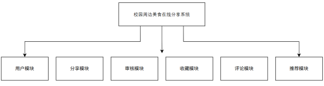
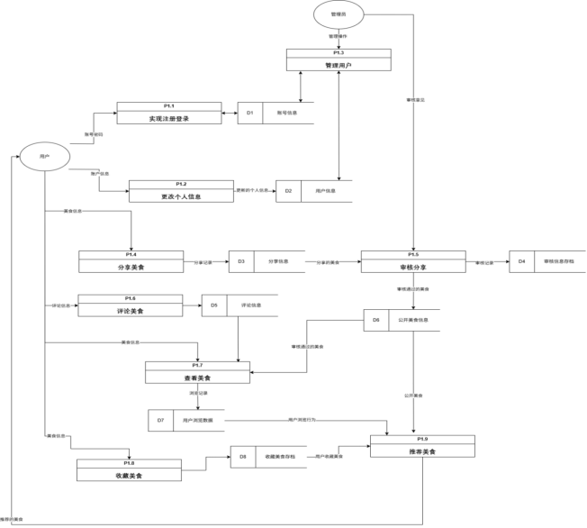
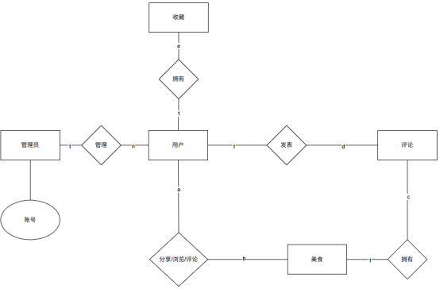
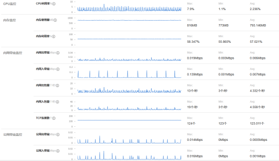

```
______              _ _____ _                    
|  ___|            | /  ___| |                   
| |_ ___   ___   __| \ `--.| |__   __ _ _ __ ___ 
|  _/ _ \ / _ \ / _` |`--. \ '_ \ / _` | '__/ _ \
| || (_) | (_) | (_| /\__/ / | | | (_| | | |  __/
\_| \___/ \___/ \__,_\____/|_| |_|\__,_|_|  \___|
                                                 
                                                 
```


### 需求分析（模块设计）



#### 数据流程图



#### 概念结构设计



#### 部署测试


